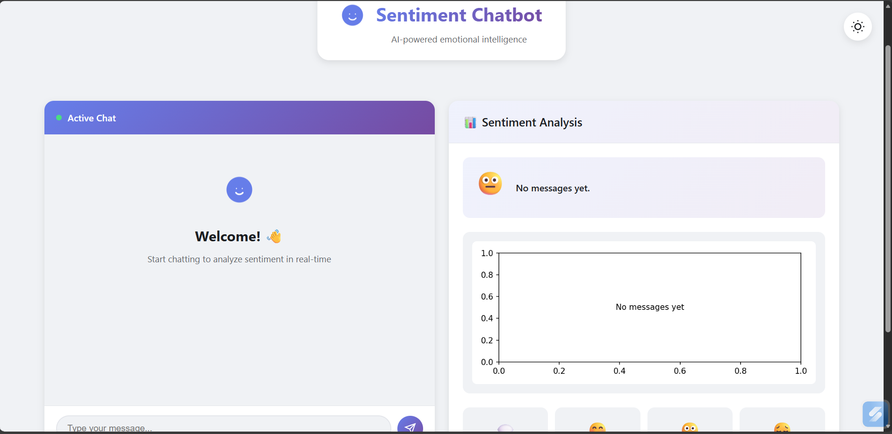
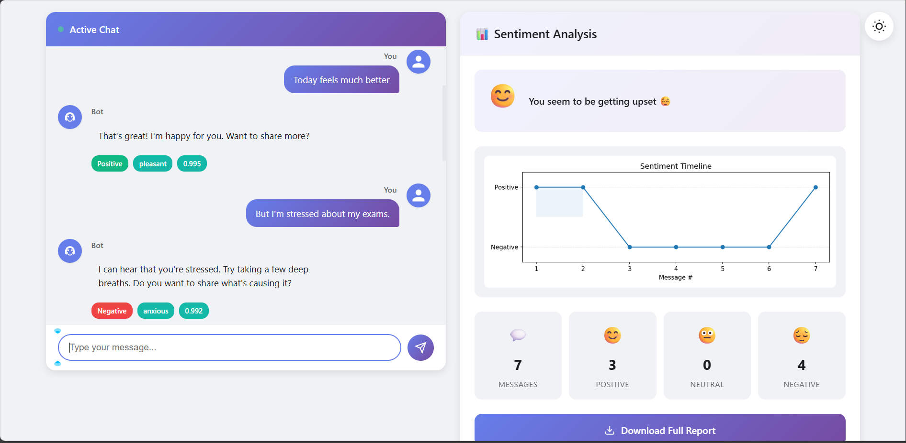
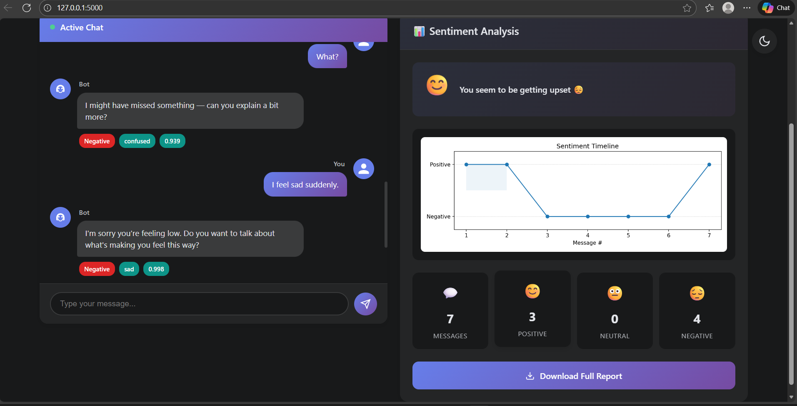

# 🌟 Sentiment Chatbot — Emotion-Aware AI Assistant

A real-time **sentiment analysis chatbot** built using **Flask**, **Transformers**, **PyTorch**, and **Matplotlib**, featuring:

- 🔍 Per-message sentiment analysis (Positive/Negative)
- 😐 Emotion detection using rule-based NLP (pleasant / sad / angry / stressed / confused / neutral)
- 📈 Sentiment timeline graph
- 🧠 Mood-shift detection (improving / worsening / stable)
- 💬 Modern chat UI (WhatsApp-style)
- 📄 Downloadable PDF report summarizing the entire conversation
- 🎨 Dark/Light mode toggle
- ⚡ Typing animations & smooth UI interactions

---

## 🚀 Features

### ✔ **Real-time Sentiment Analysis**
Uses a fine-tuned HuggingFace model (`SreyaDvn/sentiment-model`) also made by me to classify each message as **Positive** or **Negative**.
### ✔ **Emotion Detection (Rule-Based)**

In addition to ML-based sentiment (Positive/Negative), the chatbot uses rule-based NLP heuristics to detect the emotional tone of each message.

The current supported emotion categories are:

- **pleasant** — triggered by words like *better*, *nice*, *improved*, *glad*, etc.
- **sad** — triggered by words like *sad*, *unhappy*, *cry*, *hurt*, etc.
- **angry** — triggered by words like *angry*, *annoyed*, *hate*, *furious*, etc.
- **stressed** — triggered by words like *anxious*, *worried*, *fear*, *panic*, etc.
- **confused** — triggered by words like *what?*, *idk*, *huh*, *i don’t understand*
- **neutral** — fallback when no emotion keyword is detected

These emotions help the chatbot generate more natural, context-aware responses.
### ✔ **Trend Graph**
Generates a line graph showing sentiment progression across the conversation.

### ✔ **Mood Shift Detection**
Automatically determines:
- 😊 Mood improving
- 😔 Mood worsening
- 😐 Mood stable

### ✔ **Smart Bot Replies**
Emotion-aware responses:
- pleasant → cheerful/positive-toned reply
- sad → comforting reply  
- angry → calm response  
- stressed → supportive reply  
- confused → clarifying response  
- neutral → general reply  

### ✔ **PDF Report Generation**
One-click export includes:
- Full conversation transcript  
- Sentiment & emotion for each message  
- Confidence scores  
- Final sentiment summary  
- Graph embedded in the PDF  
- Mood shift interpretation  

### ✔ **Fully Responsive UI**
- WhatsApp-style message bubbles  
- Gradient avatars  
- Smooth scroll  
- Clean analytics panel  
- Dark mode  

---

## 📂 Project Structure

sentiment-chatbot/

│── app.py

│── requirements.txt

│── templates/

│ └── index.html

│── static/

│ ├── style.css

│ └── (icons, images)

│── README.md

---

## 🛠 Tech Stack

| Component | Technology |
|----------|------------|
| Backend | Flask |
| ML Model | HuggingFace Transformers + PyTorch |
| Graphing | Matplotlib |
| Frontend | HTML, CSS, JavaScript |
| PDF Engine | ReportLab |
| UI Design | Custom CSS (WhatsApp-style) |

---

## 🧠 How the Sentiment Model Was Built

### 1️⃣ Dataset Collection & Preparation

The model was trained using the Amazon Reviews dataset (3.6M reviews).
A balanced subset was used:

10,000 positive reviews

10,000 negative reviews

Preprocessing steps:

Lowercasing

Removing HTML tags

Removing numbers & punctuation

Stop-word removal

Tokenization

These steps ensured clean and consistent training data.

## 2️⃣ Fine-Tuning BERT (BERT-CH)

A custom BERT model (BERT-CH) was fine-tuned for binary sentiment classification.

Training pipeline:

Tokenization using BertTokenizer

Padding & attention masks

Model: BertForSequenceClassification

Optimizer: AdamW

Loss: CrossEntropyLoss

80/20 train–test split

Early stopping to avoid overfitting

Training steps:

Convert cleaned data → input_ids, attention_mask, labels

Train on balanced dataset

Monitor training & validation accuracy

Save best-performing model

## 3️⃣ Uploading the Model to HuggingFace

The final trained model was uploaded to:

https://huggingface.co/SreyaDvn/sentiment-model

This allows the Flask app to load the model dynamically without storing large .safetensors files in the GitHub repo.

## 4️⃣ Integration Into the Web Application

The Flask app loads the model using:

tokenizer = AutoTokenizer.from_pretrained("SreyaDvn/sentiment-model")
model = AutoModelForSequenceClassification.from_pretrained("SreyaDvn/sentiment-model")

Inference workflow:

User message → cleaned

Text tokenized

Passed to BERT

Logits → softmax → Positive/Negative

Confidence extracted

Combined with:

Emotion detection

Sentiment trend graph

Mood shift analysis

Smart bot reply

This creates the full emotion-aware sentiment chatbot.

---

## 🧪 Installation & Running Locally

### 1️⃣ Clone the Repository
git clone https://github.com/Venessadvn/sentiment-chatbot.git
cd sentiment-chatbot
### 2️⃣ Create and Activate Virtual Environment
python -m venv venv

venv\Scripts\activate      # Windows

source venv/bin/activate  # Mac/Linux

### 3️⃣ Install Dependencies
pip install -r requirements.txt
### 4️⃣ Run the Application
python app.py

Now open your browser and go to:
http://127.0.0.1:5000

### 🖼 Screenshots (Upload your own)

### 🏠 Initial UI

### 💬 Chat Interface

### 🎨 Dark Mode UI

📦 Example PDF Report
Here is one sample report generated by the app:

### 📄 Example PDF Report
[Download Example Report](assets/sentiment_report_1764233982.pdf)

### 🧩 Customization
🔧 Redefine Emotion Categories
Edit in app.py:

EMOTION_KEYWORDS = {
    "sad": {...},
    "angry": {...},
    "stressed": {...},
    "confused": {...},
    "neutral": set()
}
    
### 🔧 Change Bot Personality
Modify bot replies in:

@app.route("/chat")
### 📌 Notes
The ML model is not stored in the repo (GitHub size limit).

Instead, it is downloaded from HuggingFace:
SreyaDvn/sentiment-model

The actual code for the model can be find in Google colab at this link:
https://drive.google.com/drive/folders/1rZYV6SGBgV2I1dsE4PqFmVUbR_8E5SnZ?usp=sharing

Virtual environment & HF cache are excluded via .gitignore.

### ✨ Author
Sreya Dhar

Developer • AI Enthusiast

GitHub: https://github.com/Venessadvn
